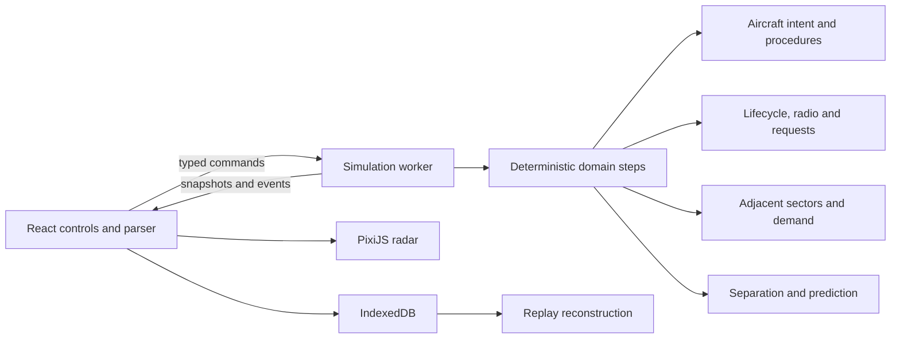

# Architecture

The application is a static Vite build. React is an interaction shell, PixiJS draws the scope, and a dedicated Web Worker owns simulation state. There is no server, authentication, telemetry, remote asset host or runtime API.

## Boundaries

- `domain`: explicit unit-bearing types, state machines, dataset/provider contracts and worker protocol.
- `data`: original dataset, performance categories, procedural source records and ten scenarios.
- `simulation`: pure stepping plus cohesive modules for communications, requests, adjacent sectors, traffic demand, attention, workload, parsing, motion, separation, prediction and replay.
- `workers`: wall-time scheduling and serialization; no React imports.
- `rendering`: local WebGL graphics, picking, panning, zooming and labels. Rendering does not change aircraft state.
- `persistence`: versioned local storage, validation and data export/import.
- `ui` and application shell: contextual commands, briefing, report and panels.

## Dataset replacement

`createState(scenario, seed, density, duration, dataset)` accepts a validated provider dataset. The dataset supplies sector/navigation geometry, geographic backdrop, traffic families, performance profiles, separation values and scenario anchors. All subsequent stepping, clearances and prediction read this snapshot. Tests run a dataset with renamed sector/fix identifiers and relocated operational geometry, then reconstruct its replay without changing the engine. Geographic backdrop metadata is separate from sector fidelity.

## Ordering and replay

One physics step is 250 ms. Commands receive the current integer tick and a sequence. A controller transmission enters the radio queue; a pilot readback follows when the channel becomes available; execution occurs only after the modeled readback lifecycle. Each step advances radio, due commands, aircraft, condition-driven requests, adjacent-sector coordination, weather, separation, prediction, demand and attention in stable order.

The replay action log includes rejected attempts, controller-position changes and manual shift completion, not only accepted instructions. System-driven radio, request, traffic-wave and coordination events reproduce from state and seed. Playback uses the same action and stepping functions. Sixty-second checkpoints reduce seek work. Living Airspace increments the engine/dataset version to 2.0; V1 recordings receive a clear incompatibility error rather than inaccurate playback. The complete dataset snapshot travels with the initial state and final state/event hashes are checked.

## Living Airspace modules

- `communications.ts` owns priority ordering, channel occupancy and deterministic radio delay.
- `requests.ts` turns route, altitude, weather and abnormal conditions into pilot requests and applies approve/deny/modified outcomes.
- `adjacentSectors.ts` turns advance notification into an inbound offer and derives neighboring load to time outbound acceptance.
- `trafficDemand.ts` implements the quiet → building → busy → peak → recovery demand curve and flow pressure.
- `workload.ts` computes the documented V2 simulator workload from active state.
- `attention.ts` derives a priority-sorted controller action queue; it does not mutate the simulation or propose resolutions.

Rendering is driven independently by Pixi's ticker. Worker scheduling consumes a wall-time accumulator at the selected multiplier. Pause and browser visibility changes prevent background progression. Large wall-time stalls are clamped deliberately: the simulator slows under overload instead of skipping physics steps.

## Deployment and offline updates

`npm run build` generates static `dist/` assets and a service worker with a content-derived cache name and an explicit precache list, including dynamically loaded renderer and worker chunks. Deployment may use a subdirectory because Vite uses relative asset paths. Serve over HTTPS (or localhost); file URLs do not provide worker/PWA guarantees. New service workers wait for old clients to close, avoiding asset replacement during a shift. Cache lookup ignores `Vary` only for this unauthenticated immutable asset cache, so static hosts emitting `Vary: Origin` cannot break offline module/style retrieval. Navigation uses the cached application shell.

## Recovery

Worker errors pause the simulation and display a recoverable message. WebGL initialization errors explain the browser requirement. Settings/replay writes surface storage errors. Import validates before transactional replacement. Replay version mismatches are rejected. A top-level React boundary permits reload without deleting local data.
