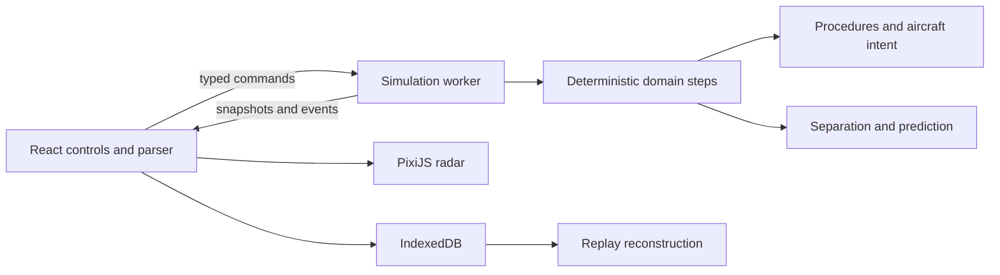

# Architecture

The application is a static Vite build. React is an interaction shell, PixiJS draws the scope, and a dedicated Web Worker owns simulation state. There is no server, authentication, telemetry, remote asset host or runtime API.

## Boundaries

- `domain`: explicit unit-bearing types, state machines, dataset/provider contracts and worker protocol.
- `data`: original dataset, performance categories, procedural source records and ten scenarios.
- `simulation`: pure stepping, parsing, validation, intent application, aircraft motion, separation, predictive trajectories and replay.
- `workers`: wall-time scheduling and serialization; no React imports.
- `rendering`: local WebGL graphics, picking, panning, zooming and labels. Rendering does not change aircraft state.
- `persistence`: versioned local storage, validation and data export/import.
- `ui` and application shell: contextual commands, briefing, report and panels.

## Ordering and replay

One physics step is 250 ms. Commands are assigned the current integer tick and a sequence number. Accepted clearances have deterministic execution ticks. A step executes due clearances, advances all aircraft, applies scenario events, evaluates separation, updates periodic predictions and bookkeeping, and checks completion. Array order and seeded generator state are stable.

The replay action log includes rejected attempts, controller-position changes and manual shift completion, not only accepted instructions. That distinction preserves history and metrics. Playback uses the same action and stepping functions. Sixty-second checkpoints reduce seek work. Stored identity and engine version protect against accidental incompatible playback.

Rendering is driven independently by Pixi's ticker. Worker scheduling consumes a wall-time accumulator at the selected multiplier. Pause and browser visibility changes prevent background progression. Large wall-time stalls are clamped deliberately: the simulator slows under overload instead of skipping physics steps.

## Deployment and offline updates

`npm run build` generates static `dist/` assets and a service worker with a content-derived cache name and an explicit precache list, including dynamically loaded renderer and worker chunks. Deployment may use a subdirectory because Vite uses relative asset paths. Serve over HTTPS (or localhost); file URLs do not provide worker/PWA guarantees. New service workers wait for old clients to close, avoiding asset replacement during a shift.

## Recovery

Worker errors pause the simulation and display a recoverable message. WebGL initialization errors explain the browser requirement. Settings/replay writes surface storage errors. Import validates before transactional replacement. Replay version mismatches are rejected. A top-level React boundary permits reload without deleting local data.
